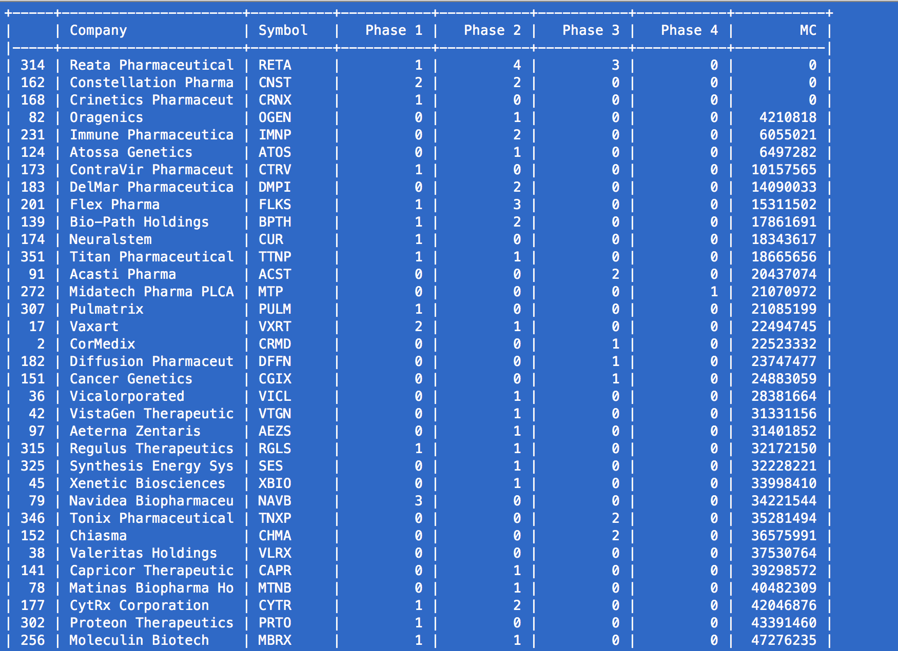

# Drug Market Data

Collect and analyze data related to clinical trials of publicly listed biotech and pharmaceutical stocks. This is intended to give a clinical pipeline and financial overview of many securities. This implementation is only possible with a license to the clinical data search engine at [api.molecularmatch.com](http://api.molecularmatch.com).

## Getting Started

Run with ...

After running this code, you will see a result like this of pharma stocks, with their numbers of trials in pipeline, and the market capitalization (MC).



### Prerequisites

Anaconda Python 3 distribution is very helpful.

https://conda.io/docs/user-guide/install/index.html

A local MongoDB server needs to be running.

https://www.mongodb.com/download-center

## Running the tests

Explain how to run the automated tests for this system

### Break down into end to end tests

Explain what these tests test and why

```
Give an example
```

## Authors

* **Shane Neeley** - *Initial work* - [Shane-Neeley](https://github.com/Shane-Neeley)

## License

This project is licensed under the MIT License - see the [LICENSE.md](LICENSE.md) file for details
